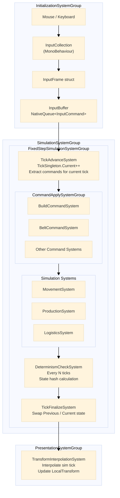

# 1. SystemGroup / Execution Order

# 2. Tick Loop Flow

[Frame Start]
↓
`InputCollectionSystem`
- Mouse Click 감지
- `InputCommand` 생성 (`TargetTick = CurrentTick + 1`)
- `InputBufferSingleton.Pending`에 Add

↓
[FixedStep 0~N회 Execute -> Unity가 dt 누적하여 자동 호출]
↓
`TickAdvanceSystem`
- `Pending` 에서 `TargetTick == CurrentTick`인 것만 추출
- 추출한 명령들을 `CommandApplyGroup`용 임시 `NativeList`에 저장
- `CurrentTick++`

↓
`CommandApplySystemGroup`
- `BuildCommandSystem` , `OccupancyMap` 갱신 etc...

↓
`SimulationSystemGroup`
↓
`DeterminismCheckSystem`
- `if (Tick % 30 == 0)` -> state hash 계산
↓
`TransformInterpolationSystem`
- 현재 Frame이 Tick 사이 어디인지 계산
- $\alpha$ = `(Time.time - lastTickTime) / TickDuration`
- `LocalTransform.Position = lerp(Previous, Current, alpha`